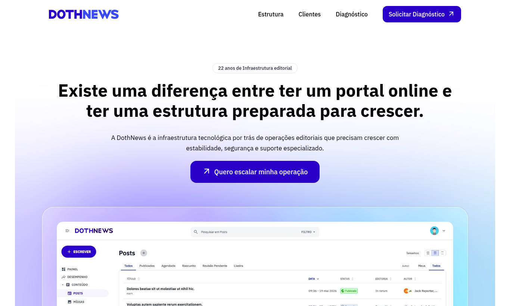
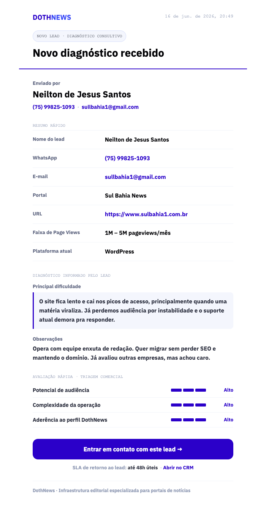

# DothNews Landing Page

Landing page institucional da DothNews, voltada para apresentar a plataforma como infraestrutura editorial especializada para portais de noticias. A pagina comunica autoridade, diferenciais tecnicos, validacao de mercado e conduz o visitante para uma solicitacao de diagnostico consultivo.



## Hospedagem

O site e hospedado na **Vercel**, na conta do Gabriel Novaes:
- Projeto: https://vercel.com/doth-team/dothnews-hotsite
- Producao: https://www.dothnews.com.br

Deploy continuo a partir da branch `main` (repositorio `onovaes/dothnews-hotsite`). Telemetria via Vercel **Speed Insights** e **Web Analytics**. Variaveis de ambiente do formulario configuradas no projeto da Vercel (ver secao de variaveis de ambiente).

## Objetivo

Esta landing foi criada para apoiar a captacao de operacoes editoriais que cresceram alem de solucoes genericas de site ou CMS. O discurso central e que a DothNews nao e uma plataforma adaptada para portais: ela foi construida para sustentar audiencia, receita, estabilidade, suporte e evolucao continua em operacoes jornalisticas digitais.

## Principais mensagens

- Infraestrutura editorial feita para crescer.
- Tecnologia propria, sem dependencias criticas de plugins de terceiros.
- Foco exclusivo em portais de noticias e operacoes editoriais.
- Estabilidade, performance, SEO tecnico e monitoramento ativo.
- Suporte especializado para contextos de redacao e cobertura em tempo real.
- Diagnostico consultivo antes de qualquer proposta comercial.

## Estrutura da pagina

- `Header`: navegacao fixa com efeito liquid glass ao rolar a pagina.
- `Hero`: headline principal, chamada para diagnostico e evidencia visual do painel editorial.
- `GrowthSection`: dores comuns de portais em crescimento.
- `ReflectionSection`: bloco de reflexao sobre infraestrutura que ficou para tras.
- `WhatSection`: explicacao da plataforma e pilares de valor.
- `WhySection`: metricas, logos de clientes e validacao de mercado.
- `EvolutionSection`: evolucao continua, IA editorial, SEO, performance e monitoramento.
- `FaqSection`: perguntas frequentes sobre migracao, suporte e perfil de operacao.
- `DiagnosisSection`: formulario local de solicitacao de diagnostico.
- `FinalCta`: chamada final para conversao.
- `Footer`: informacoes institucionais da DothNews/dothCom.

## Tecnologias

- React 18
- Vite 5
- Tailwind CSS 3
- Sass/SCSS
- PostCSS e Autoprefixer
- Pre-render SSR no build para entregar HTML indexável
- JavaScript com ES Modules
- Express (servidor de produção e endpoint de email)
- Nodemailer (envio SMTP)
- dotenv (configuração de ambiente)

## SEO e indexacao

O projeto usa uma landing de rota unica em `https://dothnews.com.br/`, com SEO tecnico concentrado em `index.html`, arquivos publicos e no build de pre-render:

- `index.html`: title, meta description, canonical, hreflang, robots, Open Graph, Twitter Card, preload da imagem LCP e JSON-LD.
- `public/robots.txt`: libera indexacao e aponta para o sitemap oficial.
- `public/sitemap.xml`: declara a URL canonica da landing e deve ter `lastmod` atualizado em publicacoes relevantes.
- `public/assets/og-image.png`: imagem social usada por Open Graph e Twitter Card.
- `src/entry-server.jsx` e `scripts/prerender.mjs`: geram HTML pre-renderizado dentro de `dist/index.html` ao rodar `npm run build`.

Ao alterar proposta, headline, secoes, FAQ, URLs de ancora, imagens sociais ou data de publicacao, revise tambem os metadados, JSON-LD, sitemap e textos compartilhados para manter consistencia entre pagina, SEO e redes sociais.

## Assets

Os assets ficam em `public/assets/` e incluem:

- Logos DothNews em SVG.
- Logos de clientes.
- Capturas do painel editorial e telas de monitoramento.
- Blobs vetoriais usados no fundo do hero.

## Estilos e UI

O projeto combina Tailwind CSS com estilos globais e SCSS pontual:

- `src/index.css`: base Tailwind, animacoes globais, utilitarios de tipografia e reveal.
- `src/styles/components.scss`: hero, efeito liquid glass e FAQ accordion.
- `tailwind.config.js`: tokens de cor, fontes e largura maxima do shell.
- `src/components/ui.jsx`: componentes compartilhados como `Shell`, `Reveal`, `Card`, `Eyebrow` e `Icon`.

O efeito liquid glass depende do filtro SVG `#container-glass` definido em `src/App.jsx` e aplicado pela classe `.liquid-glass`.

## Scripts

```bash
npm install        # instala dependências
npm run dev        # dev server Vite (porta 5299)
npm run build      # build de produção com pre-render
npm run preview    # preview do build estático
npm start          # inicia o servidor Express de produção (requer build prévio)
npm test           # roda os testes unitários (Vitest)
npm run test:watch # testes em modo watch
```

`npm run build` executa três etapas: build client do Vite, build SSR de `src/entry-server.jsx` e pre-render via `scripts/prerender.mjs`. O script também remove a pasta temporária `dist/server` e artefatos AppleDouble `._*` do `dist`.

## Testes

O projeto usa **[Vitest](https://vitest.dev/)** para testes unitários.

```bash
npm test            # executa todos os testes uma vez (usado no CI)
npm run test:watch  # re-executa ao salvar, ótimo durante o desenvolvimento
```

- Os testes ficam ao lado do código, com sufixo `.test.js` (ex.: `api/_utils.test.js`).
- Foque em **lógica pura e testável**: validação, sanitização, formatação, transformação de dados. Extraia helpers para módulos próprios (ex.: `api/_utils.js`, arquivos `_*` não viram rota na Vercel) e teste-os isoladamente.
- O CI (`.github/workflows/ci.yml`) roda `npm test` em todo push e Pull Request — PRs com testes quebrados não devem ser mergeados.

> **Para devs (humanos e IAs):** toda nova função de lógica (validação, parsing, formatação, regras de negócio) deve vir **acompanhada de testes**. Correções de bug devem incluir um teste que reproduz o bug. Mantenha e expanda a suíte — não remova testes para "fazer passar".

## Desenvolvimento

Para o servidor de email funcionar em ambiente local, são necessários dois terminais:

```bash
# Terminal 1 — servidor Express (API de email)
node server.js

# Terminal 2 — Vite dev server
npm run dev
```

O Vite faz proxy automático de `/api/*` para `localhost:3000`, então o formulário funciona no dev sem nenhuma configuração adicional.

Para validar apenas o build estático (sem testar o email):

```bash
npm run build
```

## Deploy no Vercel

O projeto agora suporta deploy no Vercel com uma função serverless para o endpoint `/api/contact`.

- A página continua sendo gerada estaticamente em `dist` via `npm run build`.
- A função `api/contact.js` implementa o fluxo de validação e template HTML para o endpoint `/api/contact`.
- Em Vercel, defina as variáveis de ambiente `MAIL_FROM`, `MAIL_FROM_NAME` e as credenciais SMTP necessárias.
- O arquivo `server.js` existe apenas para rodar o site em modo Node local/fallback; em deploy Vercel, o endpoint principal é `api/contact.js`.

A configuração de deploy está em `vercel.json`.

## Formulário de Diagnóstico — Envio de Email

### O que foi implementado

O formulário de diagnóstico em `DiagnosisSection` (e no modal `DiagnosisModal`) agora faz um `POST /api/contact` ao clicar em "Solicitar diagnóstico". Em produção Vercel, o endpoint é atendido por `api/contact.js`.

Campos coletados pelo formulário:
- **Nome completo** (obrigatório)
- **E-mail** (obrigatório)
- **Nome do portal** (obrigatório)
- **WhatsApp / Contato** (obrigatório)
- URL do portal (opcional)
- Faixa de audiência mensal (opcional)
- Plataforma atual (opcional)
- Principal dificuldade hoje (opcional, textarea)
- Observações (opcional, textarea)

Ao submeter, a API valida os quatro campos obrigatórios e envia um email HTML em **BCC** (Resend, com fallback Nodemailer/SMTP) para os destinatários definidos na variável de ambiente `CONTACT_RECIPIENTS` (lista separada por vírgula):

```
CONTACT_RECIPIENTS=destino1@exemplo.com,destino2@exemplo.com
```

Para alterar os destinatários, ajuste `CONTACT_RECIPIENTS` no `.env` local e nas variáveis de ambiente da Vercel. **Nunca** voltar a hardcodar e-mails em `api/contact.js`.

A API também aplica honeypot anti-spam (campo oculto `empresa_site`), rate-limit por IP e headers de segurança. A origem permitida do CORS vem de `ALLOWED_ORIGIN` (padrão `https://dothnews.com.br`).

O formulário exibe feedback visual durante o envio (botão com texto "Enviando…" e desabilitado) e mensagem de erro inline caso o servidor não responda ou retorne falha.

O template do email "Solicitação de diagnótstico" é montado em `api/contact.js` com HTML puro e estilos inline para compatibilidade com clientes como Gmail e Outlook. Ele inclui resumo do lead, diagnóstico informado, observações, triagem comercial automática e botão de contato via WhatsApp. Se `CRM_LEAD_URL` ou `CRM_URL` estiver configurada, o email também exibe o link "Abrir no CRM".

Para visualizar o template sem disparar email, rode `npm start` e acesse:

```text
http://localhost:3000/api/contact/preview
```



### Arquitetura

```
Usuário preenche o formulário
    ↓
React faz POST /api/contact com JSON
    ↓
`api/contact.js` valida campos obrigatórios
    ↓
Nodemailer monta email HTML e envia via SMTP
    ↓
Email chega em BCC para os destinatários
    ↓
API retorna { rs: 'ok' } → formulário mostra tela de sucesso
```

Em produção, o Express serve também os arquivos estáticos do `dist/`, sendo o único processo necessário para rodar a aplicação completa.

### O que ainda precisa ser feito para o disparo funcionar

**Passo 1 — Preencher as credenciais SMTP no servidor de produção**

Crie um arquivo `.env` na raiz do projeto com as variáveis abaixo:

```
# Destinatários dos leads (obrigatório) e CORS
CONTACT_RECIPIENTS=destino1@exemplo.com,destino2@exemplo.com
ALLOWED_ORIGIN=https://dothnews.com.br

# Envio via Resend (preferencial) — se ausente, usa o fallback SMTP abaixo
RESEND_API_KEY=<chave-resend>

# Fallback SMTP (Nodemailer)
MAIL_FROM="DothNews" <no-reply@dothnews.com>
MAIL_FROM_NAME=DothNews
MAIL_HOST=smtp.zoho.com
MAIL_PORT=587
MAIL_SECURE=false
MAIL_USER=<endereço-de-email-remetente>
MAIL_PASS=<senha-do-email-ou-app-password>
```

O domínio usa Zoho como provedor de email (registros MX apontam para Zoho). As credenciais SMTP podem ser geradas no painel Zoho em **Settings → Security → App Passwords** (recomendado) ou usando a senha da conta. O endereço em `MAIL_USER` e `MAIL_FROM` deve ser uma conta ativa no Zoho do domínio `dothcom.net`.

O arquivo `.env` **não deve ser commitado** — ele já consta no `.gitignore`.

**Passo 2 — Garantir que o servidor Node.js esteja rodando**

O site não pode mais ser servido como arquivos estáticos puros. É necessário um processo Node.js ativo. O comando de inicialização é:

```bash
node server.js
# ou, via npm:
npm start
```

Se o servidor for gerenciado por PM2:

```bash
pm2 start server.js --name dothnews-landing
pm2 save
```

Se for um container Docker, o `CMD` do Dockerfile deve ser `node server.js`.

**Passo 3 — Configurar a porta no servidor/proxy**

Por padrão, o Express escuta na porta `3000`. Ajuste a variável `PORT` no `.env` conforme necessário:

```
PORT=3000
```

Se houver um Nginx ou proxy reverso na frente (recomendado), configure-o para fazer proxy para `localhost:3000`. Exemplo de bloco Nginx:

```nginx
location / {
    proxy_pass http://127.0.0.1:3000;
    proxy_http_version 1.1;
    proxy_set_header Host $host;
    proxy_set_header X-Real-IP $remote_addr;
}
```

**Passo 4 — Build antes de subir**

Sempre faça o build antes de iniciar o servidor em produção:

```bash
npm run build
npm start
```

O `server.js` serve os arquivos de `dist/`. Se `dist/` não existir, as páginas retornarão 404.

### Variáveis de ambiente — referência completa

| Variável | Obrigatória | Padrão | Descrição |
|---|---|---|---|
| `PORT` | Não | `3000` | Porta em que o Express escuta |
| `MAIL_HOST` | Sim | — | Host SMTP (ex: `smtp.zoho.com`) |
| `MAIL_PORT` | Sim | `587` | Porta SMTP |
| `MAIL_SECURE` | Não | `false` | `true` para porta 465 (SSL), `false` para 587 (STARTTLS) |
| `MAIL_USER` | Sim | — | Usuário/email de autenticação SMTP |
| `MAIL_PASS` | Sim | — | Senha ou app password SMTP |
| `MAIL_FROM` | Sim | — | Endereço remetente (deve ser válido na conta SMTP) |
| `MAIL_FROM_NAME` | Não | `dothNews` | Nome exibido no campo "De:" |
| `CRM_LEAD_URL` | Não | — | Link direto para abrir o lead no CRM, exibido no rodapé do email |
| `CRM_URL` | Não | — | Link geral do CRM, usado como alternativa ao `CRM_LEAD_URL` |
| `EMAIL_PREVIEW_ENABLED` | Não | — | Libera `/api/contact/preview` em produção quando definido como `true` |

### Arquivos relevantes

| Arquivo | Função |
|---|---|
| `server.js` | Servidor Express local/fallback para servir `dist` e `/api/contact` |
| `.env` | Credenciais e configurações locais (não commitado) |
| `src/components/closing.jsx` | Formulário React com lógica de submit, loading e erro |

---

## Observações de manutenção

- A landing é pre-renderizada no build para melhorar indexação; preserve o marcador `<div id="root"><!--app-html--></div>` em `index.html`.
- Mantenha a URL canonica `https://dothnews.com.br/` sincronizada entre canonical, Open Graph, Twitter Card, JSON-LD, sitemap e robots.
- Atualize `dateModified` no JSON-LD e `lastmod` no sitemap quando publicar mudancas relevantes de conteudo.
- Se mudar perguntas/respostas do FAQ visual, atualize tambem o schema `FAQPage` em `index.html`.
- Se trocar imagem de compartilhamento, mantenha `og-image.png` em proporcao 1200x630 ou ajuste as dimensoes nos metadados.
- Mantenha `node_modules/`, `dist/`, `.env*`, `.claude/` e arquivos `._*` fora do Git.
- Ao alterar seções, mensagens comerciais, tecnologias, assets relevantes ou fluxo de conversao, atualize este README junto com o commit.
- Antes de qualquer commit futuro, faca uma varredura no que mudou e confirme se este README precisa refletir as alteracoes.
